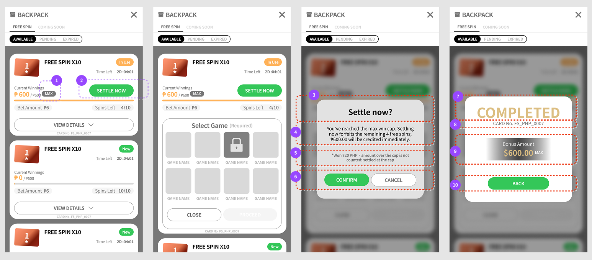
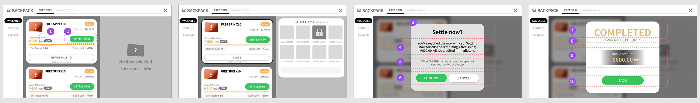

# 🖥 02-D · 提前結算與獎金上限（MAX / SETTLE NOW）

> 依據：規格 DEV V1.20（依文件矛盾審查報告修正結算觸發、逐局注單、到期結算時點與歷程顯示；上限欄位統一為 max_bonus；其餘產品規則沿用 DEV V1.15）
> 來源：DEV V1.15 §04、§07；背包原型 2026-09-14 線框
> 職能：🖥 Web 前端 · ⚙ 後端 · 🎨 美術

累積獎金達上限後，卡片多出 MAX 徽章與 SETTLE NOW，讓玩家放棄剩餘局數直接把封頂獎金拿走。

## 操作流程導覽 · 封頂後提前結算

01**MAX** → 02**SETTLE NOW** → 03**二次確認** → 04**COMPLETED** → 05**返回背包**

*CANCEL 返回背包且卡片不變；CONFIRM 才進入結算。詳細金額規則引用 09-A。*

## FREE SPIN卡 — 達到獎金上限（MAX）與結算確認彈窗

> ℹ️ **與 02 玩家端背包 Ⓓ 的關係**：02 玩家端背包「提前結算按鈕」定義了顯示條件與結算邏輯（`score ≥ max_bonus` 等三個條件、二次確認、走 00-B 端到端流程 結算三步驟）；本節在**畫面層級**補上 MAX 徽章、SETTLE NOW 按鈕、確認彈窗與完成畫面的呈現細節，兩者請對照使用。

當FREE SPIN卡的 Current Winnings 達到 Max 上限，即使 Spins Left 尚未用完，卡片會加上 MAX 徽章，並新增 SETTLE NOW 按鈕；玩家可以選擇立即結算已達上限的獎金、放棄剩餘旋轉，不需等到旋轉全部用完才能兌現。點擊 SETTLE NOW 後會先出現確認彈窗，玩家需再次點擊 CONFIRM 才會真正結算。直式與橫式既有的互動邏輯不變（見上一節「橫式選取前後對照」），只是新增的徽章與按鈕需要一併考慮進版面。

## 畫面規格 · Annotated Wireframe

*直式四畫面 — ① 收合列表（MAX 徽章＋SETTLE NOW）② VIEW DETAILS 展開後的 Select Game ③ 點 SETTLE NOW 後的結算確認彈窗 ④ CONFIRM 後的 COMPLETED 完成畫面（以 CONFIRM 關閉）。編號對應下表「#」欄。*

| 區域 | 功能（點標題看詳細說明） |
|---|---|
| 1 | MAX 徽章 |
| 2 | SETTLE NOW |

## 區域詳細說明 · MAX 徽章與 SETTLE NOW

### 1 MAX 徽章

*把「已達上限」和「卡片狀態」分開講。*

**限制與規則**

- 達到 Max 上限時顯示；淺綠色外框膠囊小字「MAX」

**防呆與錯誤**

- 與「In Use」／「New」等生命週期狀態的**實心膠囊區分**，避免混淆「卡片狀態」與「獎金已達上限」這兩種不同性質的訊息

### 2 SETTLE NOW

*不想玩完也能把獎金拿走。*

**限制與規則**

- 綠色實心主要按鈕；按鈕下方另有提示文字「Forfeit remaining spins, claim the capped bonus now」，點擊前先說明後果
- 點擊後彈出結算確認彈窗；確認後立即結算已達上限的獎金並放棄剩餘 Spins Left

**防呆與錯誤**

- —

VIEW DETAILS 與未達上限的卡片相同；點擊展開後 Select Game 內嵌於同一張卡片中，MAX 徽章與 SETTLE NOW 仍保留在原位置，卡片最下方改為 CLOSE／PROCEED（見「欄位總覽」編號 10–11）。

*橫式四畫面 — ① 未選取時右側為面板空狀態 ② 選取後卡片外框標示＋獨立 Select Game 面板（面板內僅 PROCEED，CLOSE 留在卡片上）③ 結算確認彈窗（下表 #3–6）④ COMPLETED 完成畫面（下表 #7–10）。彈窗覆蓋整個背包視窗。*

橫式的卡片外框選取、CLOSE 取代 VIEW DETAILS、Select Game 獨立面板（面板內僅 PROCEED，CLOSE 留在卡片上），以及遊戲格的 Locked／Selected 樣式皆與既有規則相同（見「橫式選取前後對照」、「遊戲格狀態」）；卡片本身僅多了 MAX 徽章與 SETTLE NOW，位置與直式一致。

## 結算確認彈窗與完成畫面

結算確認彈窗：直式與橫式共用同一套版面規則（見上方直式與橫式對照圖），彈窗會蓋住整個 BACKPACK 視窗（包含 Select Game 面板），避免玩家在確認前誤觸其他操作。

| # | 欄位 | 說明 |
|---|---|---|
| 3 | 標題「Settle now?」 | 直接對應觸發的 SETTLE NOW 按鈕 |
| 4 | 說明文字 | 告知玩家已達上限、結算後會放棄的剩餘 Spins Left 次數，以及即將入帳的金額（以「₱」符號顯示）；次數與金額須即時對應該FREE SPIN卡當下的實際數值 |
| 5 | 小字說明 | 「Won ○○ ₱ · amount over the cap is not counted; settled at the cap」；顯示玩家實際贏得的金額與上限的差異，讓「結算金額為何比實際贏得少」保持透明。 |
| 6 | CONFIRM ／ CANCEL | CONFIRM（綠色實心，左側）：確認結算；FREE SPIN卡以 Max 上限金額（`max_bonus`）立即入帳〔V1.20 改〕、剩餘 Spins Left 作廢，並顯示 COMPLETED 完成畫面。CANCEL（外框，右側）：取消，關閉彈窗返回原畫面，FREE SPIN卡狀態不受影響。 **備註：**此處 CONFIRM 刻意放在左側，與畫面中其他 CONFIRM／PROCEED 一律置右的慣例相反 — 目的是打破玩家的慣性點擊習慣，避免手滑或誤觸而不小心確認這個不可逆的結算動作 |
| 7 | 「COMPLETED」標題 | 結算完成後顯示的畫面標題，取代原本的「Settle now?」確認彈窗 |
| 8 | Card No. | 同「欄位總覽」編號 9，顯示此FREE SPIN卡的卡片編號，方便對照 |
| 9 | **Bonus Amount** | 本次結算實際入帳的金額（等同 Max 上限），下方附「Max Cap Reached」徽章重申結算原因。不寫「Maximum Payout Amount」，此標籤與一般結算彈窗共用，一般結算的金額通常低於上限，寫成「最高」會造成誤解（提前結算時恆等於上限） |
| 10 | **CONFIRM** | 綠色實心按鈕，**本畫面唯一出口**：按下後關閉完成畫面、返回背包列表。不做「點擊任意處關閉」——這一步已入帳真金，需要玩家明確按下 |

本節兩張截圖（直式／橫式）已換新版：#9 欄位標籤已改為 **Bonus Amount**，`Amout` 筆誤也已修正為 `Amount`。畫面中的幣別符號（$／₱）僅為示意，實際顯示依玩家錢包幣別與系統格式化（見 02 玩家端背包 i18n 備註①），美術稿不需要求與特定幣別一致，故不再視為待修正項。
