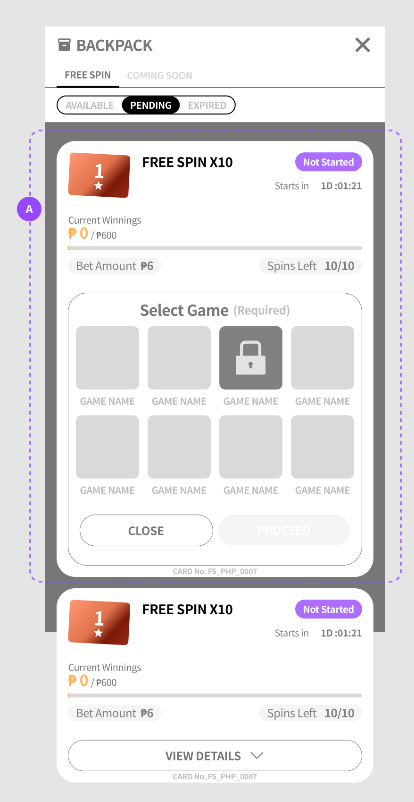
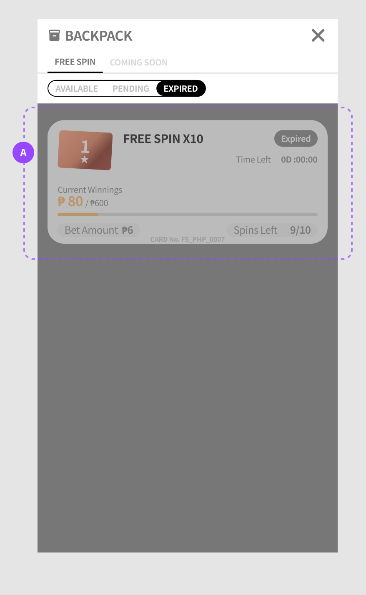

# 🖥 02-E · 空狀態 · 待啟動 · 已過期

> 依據：規格 DEV V1.20（依文件矛盾審查報告修正結算觸發、逐局注單、到期結算時點與歷程顯示；上限欄位統一為 max_bonus；其餘產品規則沿用 DEV V1.15）
> 來源：DEV V1.15 §04、§07；背包原型 2026-09-14 線框
> 職能：🖥 Web 前端 · 🎨 美術

三種「不能用」的畫面：一張卡都沒有、時間還沒到、時間已經過了。

## 列表空狀態〔V1.14 新增〕

原規格未定義「這個分頁一張卡都沒有」時畫面要顯示什麼，前端沒有字可用、也沒有版面依據。本節補上；線框見 05 美術 背包面板總覽（含空狀態）。

### 列表空狀態

*目前分頁／篩選條件下沒有任何卡時顯示。*

**限制與規則**

- **依「分頁 × 篩選」各自判斷**——「可使用」沒有卡但「已過期」有卡時，只有前者顯示空狀態；切換篩選後依該條件重新判斷是否顯示
- 內容＝提籃圖示 ＋ 主文「**No items available**」＋ 輔助說明「**Get it from daily chest!**」〔V1.15 改〕
- **Select Game 面板空狀態（僅橫式）**：尚未點擊任何卡片時顯示「？」圖示＋「**No item selected**」＋「**Select to use an item**」；一旦點擊卡片，立即被 Select Game 面板取代〔V1.15 新增〕
- **空狀態不影響標頭與導覽**：分頁與篩選列照常可操作

**防呆與錯誤**

- **空狀態與載入中必須分得開**——資料還在取的時候不可先顯示空狀態，否則玩家會誤以為卡片不見了
- 玩家未持任何卡時仍可正常開啟背包（入口定義見 03 遊戲內與結算），開啟後看到的就是本狀態

## 待啟動分頁（唯讀 · 可展開瀏覽 · 顯示開始倒數）

卡片若設定的開始時間（`valid_from`）尚未到，**不可與可使用卡混在一起**——否則玩家會點下去卻進不了遊戲。DEV V1.6 起這類卡獨立成「待啟動」分頁。

## 畫面規格 · Annotated Wireframe

*待啟動分頁 · 紫框 Ⓑ′＝待啟動卡（藍紫徽章 Not Started、「Starts in {t}」開始倒數、卡片明細照常顯示、Select Game 可展開瀏覽但 PROCEED 永遠押灰）· 點圖放大*

### Ⓑ′ · 待啟動卡

*開始時間還沒到的卡，可預覽但不能用。〔DEV V1.6 新增〕*

**限制與規則**

- `valid_from` **未到的卡歸入本分頁**，不出現在「可使用」分頁
- **唯讀**：VIEW DETAILS 可以展開、Select Game **可以瀏覽**，但**不可選取遊戲、PROCEED 永遠押灰不可按**，也不可取得遊戲入口〔V1.15 改〕
- 顯示「**{t} 後開始**」倒數（時間基準 **UTC+8**，與到期倒數同一基準）
- 卡片明細（`bet`／次數／`max_bonus`／遊戲牆）**照常顯示供玩家預覽**——讓玩家先知道自己拿到什麼

**防呆與錯誤**

- **開始時間一到自動轉入「可使用」分頁**（毋須重新整理）
- 狀態徽章顯示「**待啟動**」（藍紫，樣式見 05 美術 標籤五態）

## 已過期分頁（整卡置灰唯讀）

*已過期分頁 · 紫框 Ⓐ′＝已過期卡（Expired 灰徽章、Time Left 0D:00:00、Current Winnings 顯示最終結算金額 ₱80、Spins Left 保留 9/10、整卡置灰唯讀且無 VIEW DETAILS）· 點圖放大*

### Ⓐ′ · 已過期卡

*過期卡的最終狀態展示。*

**限制與規則**

- 沿用可使用卡的同一組欄位，**不另做「Settled Bonus」列**：`Current Winnings` 顯示的就是**最終結算金額**＝`min(score, max_bonus)`，進度條停在結算當下的比例
- `Spins Left` **保留結算當下的數字**（例：到期時剩 9/10 未轉，就顯示 9/10）——不歸零，讓玩家看得出「還剩幾次沒用到」
- `Time Left` 顯示 `0D:00:00`
- 狀態徽章「已過期」（灰）；**無 VIEW DETAILS 按鈕、不可展開**

**防呆與錯誤**

- 整張卡**置灰唯讀**、按鈕不可按
- 不可再取得遊戲入口

> ℹ️ **為什麼要留著給玩家看**：過期卡把**最終獎金與未用完的次數一起留在畫面上**，讓玩家自己核對「這張卡最後給了我多少、還剩幾次沒用到」，減少「卡不見了／沒給錢」類客訴。
