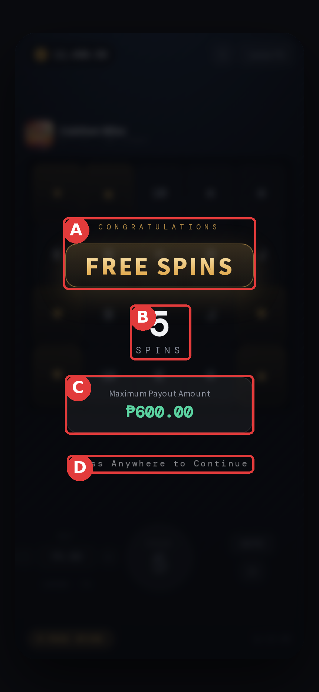
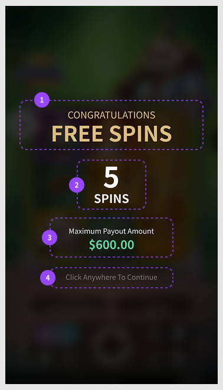

# 🖥 03-A · 進場提示彈窗

> 依據：規格 DEV V1.20（依文件矛盾審查報告修正結算觸發、逐局注單、到期結算時點與歷程顯示；上限欄位統一為 max_bonus；其餘產品規則沿用 DEV V1.15）
> 來源：DEV V1.15 §04、§08；背包原型 2026-09-14 線框
> 職能：🖥 Web 前端 · 🎨 美術

進場先跳一次彈窗，告訴玩家「有幾局可玩」與「最多能拿多少」，玩家點任意處才開第一局。

## 操作流程導覽 · 進場到整卡結算

01**進場提示** → 02**FREE SPIN 模式** → 03**結算觸發** → 04**結算彈窗** → 05**一般模式**

*流程只連接畫面狀態；局數、score 與入帳規則以 09-A 為唯一來源。*

> ⚠️ **本章與 02 玩家端背包 的分界**：按下背包的「進入遊戲」**之前**（選卡、選攜帶遊戲、綁卡、取入口）看 [02 玩家端背包](affine://02-B)；**進入遊戲之後**的三個畫面（進場提示 → 遊戲中 → 結算）看本章。結算的金額怎麼算（score → 封頂 → 入帳）在 [00-B 端到端流程 結算三步驟](affine://00-B)，本章只講「玩家看到什麼」。

## 畫面一 · 進場提示彈窗

## 畫面規格 · Annotated Wireframe

*2026-08-25 原型實拍（示範遊戲＝Caishen Wins）· 紅框 Ⓐ–Ⓓ 對應右表 · 續玩卡顯示剩餘 5 SPINS 非總數 · 點圖放大*

| 區域 | 功能（點標題看詳細說明） |
|---|---|
| Ⓐ | FREE SPINS 模式標題 |
| Ⓑ | 可玩局數 {n} SPINS |
| Ⓒ | 最高可獲得獎金（封頂） |
| Ⓓ | 點任意處開始 |

## 區域詳細說明 · 畫面一

### Ⓐ · FREE SPINS 模式標題

*告訴玩家「接下來這幾局是免費的」。*

**限制與規則**

- 此彈窗**由卡片啟動**，與遊戲本身 Scatter 觸發的免費遊戲是兩件事
- 標題為**美術圖**，全語系統一英文（不逐語系另做圖）
- **標題為兩行**：上行「**CONGRATULATIONS**」（恭喜語，字級較小）＋下行「**FREE SPINS**」（主標，字級較大）——原規格只寫「FREE SPINS 標題」，未寫上方還有一行恭喜語，美術與前端據此會少做一段〔V1.14 補〕

**防呆與錯誤**

- 沒帶卡進場時**絕不可出現本畫面**（詳見本章錯誤處理「未進入 FS 模式」）

### Ⓑ · 可玩局數 {n} SPINS

*這次進場可以玩幾局。*

**限制與規則**

- 顯示**該卡目前剩餘局數**（`rounds_left`），**不是總局數**
- 續玩未用完的卡（如 5/10）時顯示 **5**，不是 10

**防呆與錯誤**

- 數字必須與背包卡片的「剩餘次數」一致，不一致以我方快照為準

### Ⓒ · 最高可獲得獎金（封頂）

*先講清楚上限，避免「贏很多卻只給上限」的爭議。*

**限制與規則**

- 數值＝該卡的 `max_bonus`，與背包 Ⓓ 進度條的分母同一個數字
- 幣別與格式依**玩家錢包幣別**顯示
- 欄位標籤為「**最高可獲得獎金**」（Maximum Payout Amount），置於金額上方——文案見 02 玩家端背包 文案表 `fs_max_payout_label`〔V1.14 補〕

**防呆與錯誤**

- 此數字**是上限不是保證**；文案不得寫成「可獲得 ○○」等承諾語

### Ⓓ · 點任意處開始

*玩家自己按下才開第一局。*

**限制與規則**

- 本彈窗**每次進場只出現一次**；同一次遊戲期間不重複跳
- **不自動關閉、不自動開局**；若遊戲端有既有自動關閉機制，至少須顯示 2 秒
- 斷線重連回到同一張卡時**不重跳**，直接回到剩餘局數狀態

**防呆與錯誤**

- 彈窗未關閉前**不得扣任何局數**
- 提示文字為「**點擊任意處繼續**」（Press Anywhere to Continue）——文案見 02 玩家端背包 文案表 `fs_entry_continue_hint`，條文原本未指名，前端容易自行編字〔V1.14 補〕

── 畫面二 ──

## 進場提示彈窗

點擊 Proceed 後，先出現這個彈窗，玩家再點擊任意處才會真正進入所選遊戲；直式與橫式共用同一張畫面。

*進場提示彈窗 — 顯示中獎彈窗與免費旋轉次數。*

| # | 欄位 | 說明 |
|---|---|---|
| 1 | CONGRATULATIONS / FREE SPINS | 標題文字，告知玩家已成功兌換 |
| 2 | SPINS 次數 | 此次兌換獲得的免費旋轉次數，與該FREE SPIN卡的 Spins Left 對應 |
| 3 | Maximum Payout Amount | 此次免費旋轉可派發的最高獎金，與FREE SPIN卡的 Max 上限對應 |
| 4 | Press Anywhere to Continue | 點擊畫面任意處即關閉彈窗，進入所選遊戲 |
