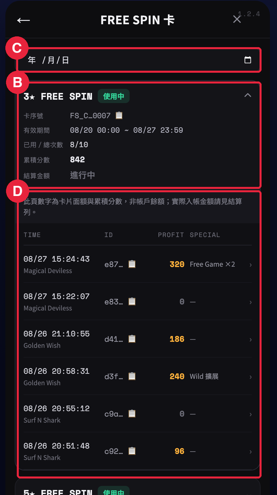

# 🖥 04-C · L3 · FREE SPIN 卡片清單

> 依據：規格 DEV V1.20（依文件矛盾審查報告修正結算觸發、逐局注單、到期結算時點與歷程顯示；上限欄位統一為 max_bonus；其餘產品規則沿用 DEV V1.15）
> 來源：DEV V1.15 §09；DEV V1.12 歷程決策
> 職能：🖥 Web 前端 · ⚙ 後端

一張卡一列，以 reference_id 為主鍵、發卡時間倒序，點列展開該卡全部局。

*L3 · FREE SPIN 卡片清單實拍（《遊戲歷程活動頁原型》2026-09-02）〔V1.18 新增〕· Ⓒ 日期篩選器 · Ⓑ 卡片列（分組標頭：卡序號／有效期間／已用總次數／累積分數／結算金額）· Ⓓ 展開後的局歷程列表（Ⓓ 的規格在 04-D，此處一併框出是因為原型上它就接在卡片列底下）。畫面中第二張卡「5★ FREE SPIN」的累積分數標示「1,180 已封頂，結算以上限為準」，即 09-A 的 min(score, max_bonus) 封頂規則在玩家端的呈現。*

## L3 · FREE SPIN 卡片清單

### Ⓑ · 卡片列（分組標頭）

*一張卡一列，reference_id 為主鍵；點列展開該卡全部局。*

**限制與規則**

- 排序＝**發卡時間倒序**（最新的卡在最上面）
- 每列欄位（自左至右）： ① **卡名**「{n}★ FREE SPIN」（同背包固定卡名） ② `reference_id` **短碼＋複製 icon**（樣式仿既有 ID 欄；點複製取**完整值**） ③ **有效期間** `valid_from ~ valid_to` ④ **已用／總次數**（如 `8/10`） ⑤ **累積分數** `score`——**純數字、不帶幣值符號** ⑥ **結算金額**——**帶幣值符號、橘黃色**；未結算時：已開打顯示「進行中」灰字、從未開打顯示「未使用」灰字〔V1.20 改〕 ⑦ **狀態徽章**（使用中／已結算／已過期未使用） ⑧ 展開 chevron
- **⑤與⑥的視覺必須有差別**：⑤是分數（無幣值）、⑥是真金（有幣值）。這是本頁最容易被玩家誤解的一組數字
- score 已達封頂：⑤ 仍顯示**實際 score**，其後加小字「已封頂，結算以上限為準」
- 展開為**手風琴**：一次只展開一張卡（避免長列表迷路）

**防呆與錯誤**

- 卡片已發但玩家從未開打：可展開，L4 顯示「此卡未使用過」，結算欄顯示「未使用」；徽章仍有效時為「使用中」、過期後為「已過期未使用」（到期未使用的卡不結算、不寫結算注單）〔V1.20 補〕
- 卡片已開打、尚未結算：結算欄一律「進行中」，**不得顯示預估金額**（避免玩家把預估當承諾）
- 已過期未使用的卡仍列出並置灰，供客訴查詢
- 清單為空（玩家從未取得 FS 卡）：置中顯示空狀態文案，不顯示表頭

### Ⓒ · 日期篩選器

*篩出「該日期有使用紀錄」的卡片。*

**限制與規則**

- 作用對象＝**卡片清單**：選定日期後，只列出**該日期當天有至少一局使用紀錄**的卡
- **不是**用來篩「該日期發的卡」，也**不裁切**展開後的局數——展開仍顯示**該卡全部局**（否則 score 與列出的局對不起來）
- 預設值＝**不篩選（全部）**；玩家主動選日期才生效，並顯示「清除篩選」
- 樣式沿用既有遊戲明細頁的日期選擇器元件

**防呆與錯誤**

- 選到沒有任何使用紀錄的日期：顯示「該日期無使用紀錄」＋「清除篩選」按鈕，**不要顯示空白畫面**
- 日期以 **UTC+8** 判定（同全站時區慣例，見 09-A 全域約定）
